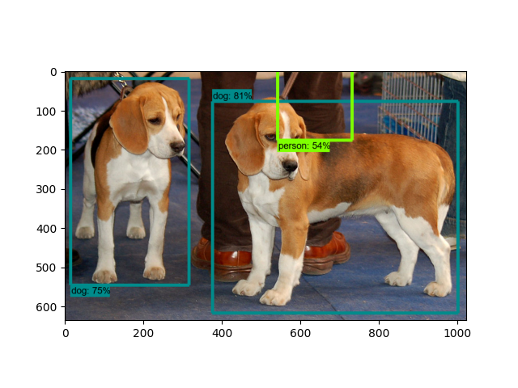
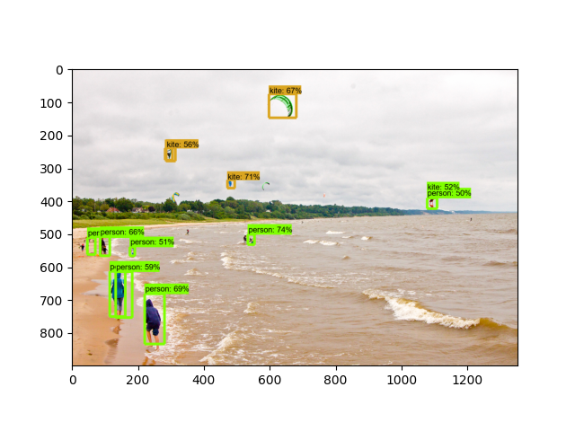
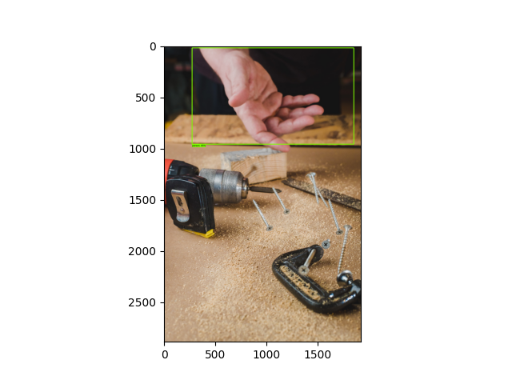

# Tensorflow_model_learning

## Common Setup and First Model
### 1. Pre-requisite
    Python (Version 3.9) 
    Protobuf
    Anaconda
### 2. Create Virtual Environment
    git clone https://github.com/tensorflow/models.git
    conda create -n {environment_name} pip python=3.9
    conda activate {environment_name}
### 3. Install Protobuf in project
    conda install protobuf
    Add use_protobuf.py into models/research/ directory
    cd models/research/
    python use_protobuf.py object_detection/protos protoc
    protoc object_detection/protos/*.proto --python_out=.
### 4. Install Dependencies
    Copy /models/research/object_detection/packages/tf2/setup.py to models/research/ directory
    python -m pip install .
### 5. Test all dependencies are installed or not
    python object_detection\builders\model_builder_tf2_test.py
    If any dependecy is pending: conda install {name}
### 6. Tensorflow Model Zoo
    pip install wget
    python model_downloader.py
### 7. Run Detection Script
    Create a folder "outputs"
    python .\detect_from_image.py -m ssd_mobilenet_v2_320x320_coco17_tpu-8\saved_model -l .\models\research\object_detection\data\mscoco_complete_label_map.pbtxt -i .\models\research\object_detection\test_images
### 8. Check Results in Outputs folder

### 9. Detection through Webcam
    python .\detect_from_webcam.py -m ssd_mobilenet_v2_320x320_coco17_tpu-8\saved_model -l .\models\research\object_detection\data\mscoco_complete_label_map.pbtxt

## Training New Model from Scratch
### 1. Pre- Setup
    Follow the previous steps 1 to 5 as it is
### 2. Preparing Images
    Collect images for each category
    Keep 80% of the Images from each category into one folder /images/train
    Keep the rest 20% in another folder /images/test
    pip install labelImg
    labelImg.exe
    Open the train directory in LabelImg and annotate each image- XML file for each image will be created
    Do the same for the test folder
### 3. Convert XML to CSV
    python xml_to_csv.py
### 4. Generate TF records
    python generate_tfrecord.py --csv_input=images/train_labels.csv --image_dir=images/train --output_path=train.record
    python generate_tfrecord.py --csv_input=images/test_labels.csv --image_dir=images/test --output_path=test.record
### 5. Tensorflow Model Zoo
    pip install wget
    python model_downloader.py
### 6. Create LabelMap
### 7. Edit Config file
### 8. Start Training
### 9. Export Model
### 10. Run Detection Script
